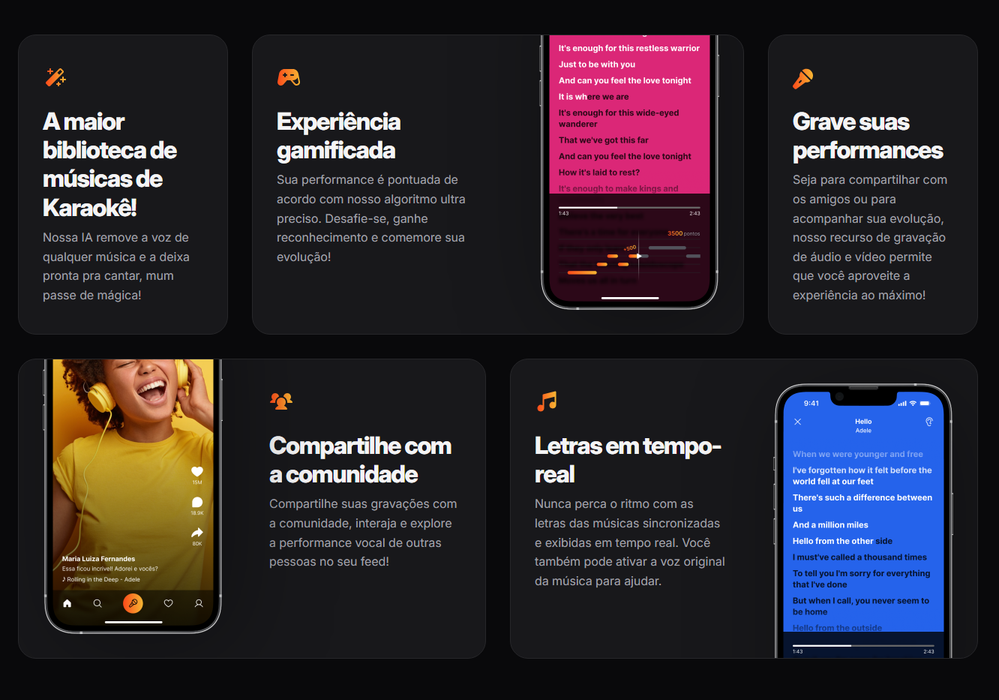
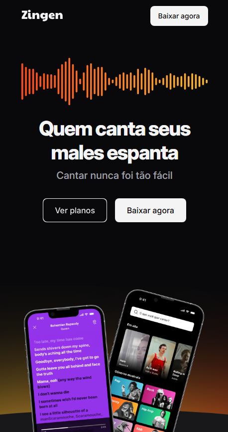
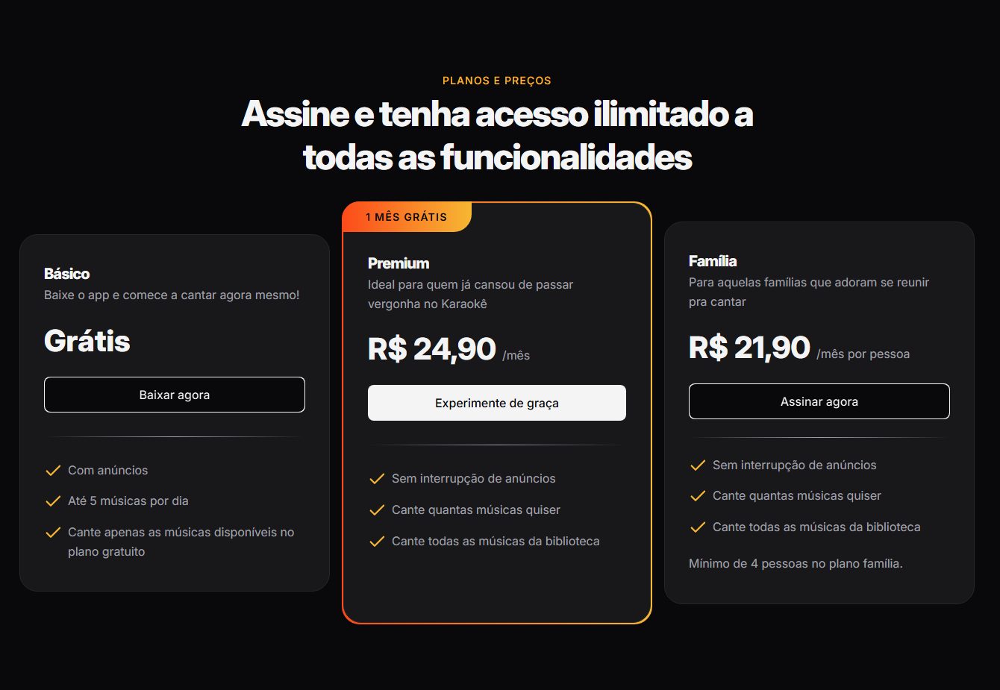

  

  

  

# 🎤 Zingen – Landing Page de Aplicativo de Karaokê

## 📌 Sobre o Projeto

O **Zingen** é uma Landing Page de marketing desenvolvida para apresentar um aplicativo de Karaokê moderno e interativo.

Este projeto foi desenvolvido durante a formação **Full-Stack**, como parte dos conteúdos de especialização, com foco na prática de HTML e CSS, responsividade e organização de layout.

A proposta foi criar uma página completa, atrativa e totalmente responsiva, simulando um produto real no mercado.

---

## 🚀 Tecnologias Utilizadas

* HTML5
* CSS3
* Layout Responsivo (Media Queries)
* Flexbox
* Grid Layout

---

## 🎯 Objetivos do Projeto

* Estruturar uma Landing Page profissional
* Aplicar boas práticas de HTML semântico
* Trabalhar estilização moderna com CSS
* Desenvolver layout responsivo para diferentes dispositivos
* Organizar seções de marketing (Hero, Benefícios, Planos, CTA, etc.)

---

## 📱 Responsividade

A página foi desenvolvida com foco em:

* Desktop
* Tablet
* Mobile

Utilizando Media Queries e técnicas modernas de layout para garantir uma boa experiência em qualquer dispositivo.

---

## 🧠 Conceitos Aplicados

* Estruturação semântica com HTML
* Organização de CSS
* Posicionamento com Flexbox e Grid
* Tipografia e hierarquia visual
* Design voltado para conversão (Landing Page)

---

## 🎨 Funcionalidades da Landing Page

* Seção Hero com destaque do aplicativo
* Seção de planos
* Design moderno e limpo
* Layout 100% responsivo

---

## 📖 Sobre a Formação

Projeto desenvolvido como prática durante a formação **Full-Stack**, com foco em desenvolvimento web front-end.

